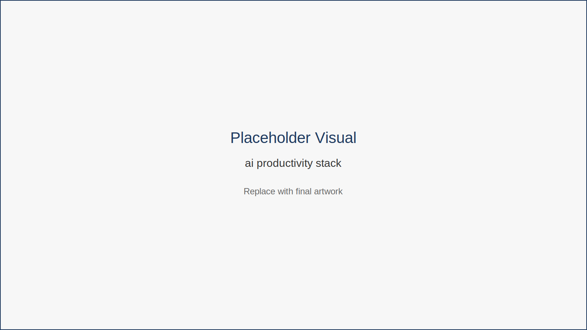
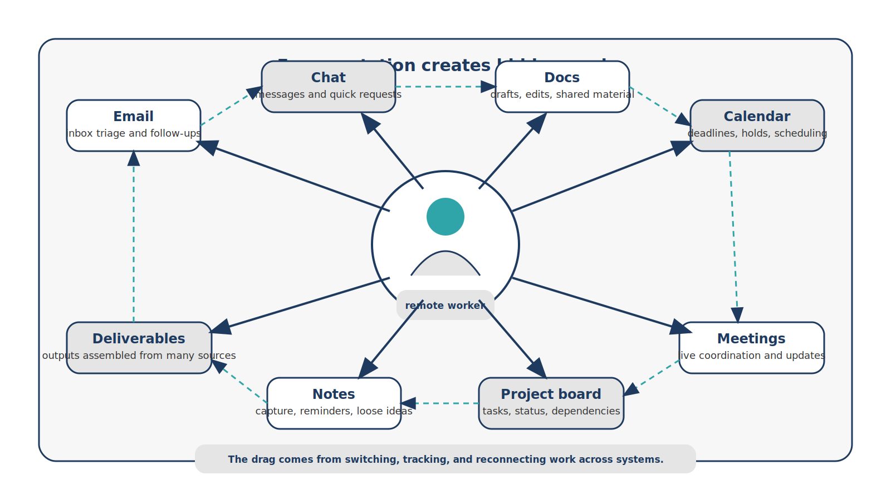

# The Hidden Productivity Problem

Many remote professionals feel busier than ever.

They manage dozens of browser tabs, endless Slack notifications, overflowing inboxes, and project boards filled with tasks. Yet at the end of the day, it can feel unclear what meaningful progress was actually made.

This is the productivity paradox of remote work.

Working from anywhere should increase efficiency.

But often it does the opposite.

---

## Fragmentation Is the Real Problem

The issue is not simply workload.

It is fragmentation.

Remote professionals frequently manage work across many systems:

- email  
- messaging platforms  
- project management tools  
- note-taking apps  
- shared documents  
- calendars  
- video calls  

Each tool solves a specific problem.

Together, they often create cognitive overload.

The structure of this problem becomes clearer when we examine how productivity layers operate in modern work.

*Figure 2.1 — AI Productivity Stack*

This stack illustrates the different layers involved in knowledge work: decision making, communication, information processing, and task execution. AI assistance can support each layer by reducing repetitive work and organizing information more effectively.

---

Another way to understand the challenge is to visualize the complexity of the modern remote workflow environment.

*Figure 2.2 — Fragmented Remote Workflow Map*

This map shows how remote professionals often move constantly between tools, conversations, and information sources. The resulting context switching reduces focus and slows progress. AI tools can act as connectors that simplify these fragmented workflows.

---

## Four Sources of Remote Productivity Loss

**Communication Overload**

Conversations move across multiple platforms.

Important information becomes scattered.

**Administrative Creep**

Scheduling, reporting, documentation, and coordination quietly expand.

These tasks are necessary but rarely produce direct value.

**Context Switching**

Moving constantly between tools breaks focus and slows deep work.

**Information Saturation**

Remote workers consume enormous amounts of information but struggle to extract clear insight.

---

## Fictional Example Based on Common Remote Work Situations

Maria is a freelance designer managing projects for clients in three countries.

Her typical day involves:

- reviewing client briefs  
- responding to email threads  
- designing graphics  
- updating project boards  
- preparing presentations  

None of these tasks are individually overwhelming.

But the constant switching between them drains time and attention.

Once Maria begins introducing AI assistance for summarizing briefs, drafting updates, and organizing information, the number of micro-tasks decreases dramatically.

---

## Key Insight

The real productivity challenge is not effort.

It is unstructured workflows.

---

## Chapter Takeaways

- Remote work increases flexibility but also fragmentation.  
- Productivity losses often come from coordination and administrative overhead.  
- AI can reduce these burdens when used intentionally.  
- Tools alone are not the solution — workflow design is.

---

## Action Plan

Write down the five most repetitive tasks you perform each week.

For each task ask:

- Does this require judgment?  
- Could AI assist with part of it?  
- Could part of the process be automated?

These answers will become the foundation for your workflow redesign later in the book.

---

## Transition

Before redesigning workflows, we need a realistic understanding of the technology itself.

The next chapter explains what AI assistants actually do well — and where human judgment still matters most.
