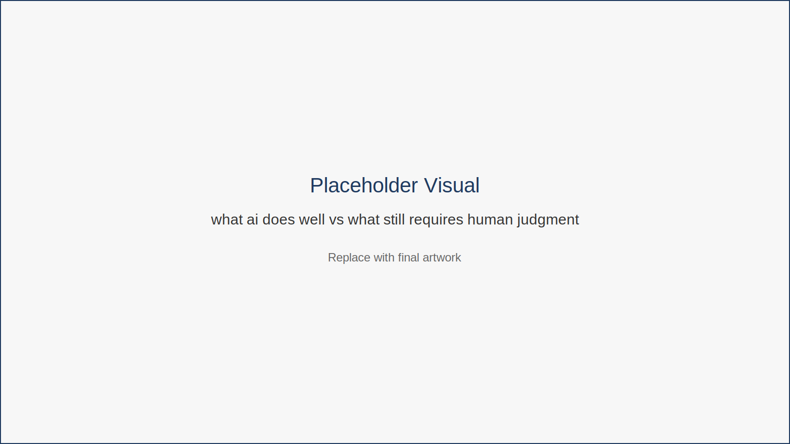

# Chapter 3  
## Understanding AI Assistants

### Opening Hook

AI systems can now draft emails, summarize documents, generate graphics, analyze data, and answer complex questions.

But this creates confusion.

Are these systems experts?  
Research engines?  
Creative partners?

The best way to think about modern AI is simpler.

---

## AI as an Assistant, Not an Authority

AI systems are powerful pattern-recognition tools trained on enormous datasets.

They excel at:

- drafting text  
- summarizing information  
- brainstorming ideas  
- structuring content  
- translating or reformatting material  

But they struggle with:

- factual certainty  
- contextual judgment  
- strategic decision making  
- domain expertise without verification  

This distinction is essential.

AI can accelerate many tasks, but human oversight remains critical.

The difference between AI strengths and human strengths becomes clearer when viewed side by side.

*Figure 3.1 — What AI Does Well vs What Still Requires Human Judgment*

This comparison highlights the complementary relationship between AI systems and human professionals. AI excels at speed, pattern recognition, and draft generation, while humans contribute judgment, context, and strategic thinking.

---

## Roles AI Often Plays in Knowledge Work

**Drafting Assistant**

Creates first drafts of documents, emails, and outlines.

**Summarization Tool**

Condenses long material into digestible insights.

**Idea Generator**

Helps explore alternative approaches or creative directions.

**Information Organizer**

Structures messy input into clearer formats.

---

## Fictional Example

Lina is a marketing manager who receives a twelve-page client brief.

Instead of manually extracting key points, she asks an AI assistant to summarize:

- project goals  
- deadlines  
- required deliverables  

The summary becomes her starting point for strategy.

But Lina still verifies details and defines the campaign approach herself.

AI accelerates preparation.

Human judgment remains central.

---

## Key Insight

AI produces drafts and suggestions, not final authority.

---

## Chapter Takeaways

- AI assistants are powerful but imperfect tools.  
- Their strength lies in accelerating common knowledge-work tasks.  
- Human oversight ensures accuracy and context.  
- Treat AI as a collaborator rather than a replacement.

---

## Action Plan

Try three small experiments this week.

Ask AI to summarize a long document.  
Ask AI to draft an outline for a task you must complete.  
Ask AI to brainstorm possible solutions to a problem.

Notice where AI helps — and where your judgment improves the result.

---

## Transition

Understanding AI is only the first step.

The real advantage appears when AI becomes part of structured workflows.
