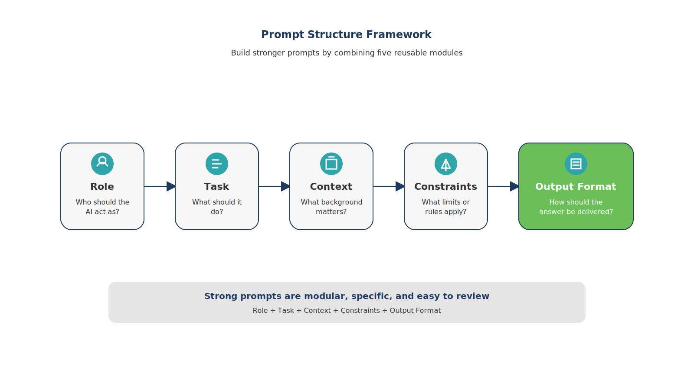
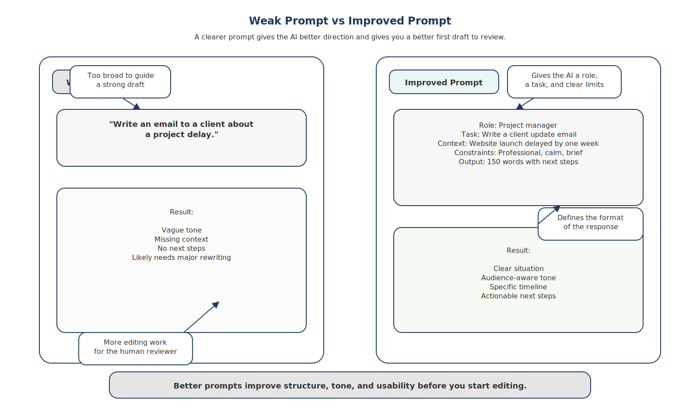

# Prompting: How to Work with AI Effectively

AI assistants respond to instructions.

The quality of their output depends largely on how clearly you communicate with them.

This skill is known as prompting.

---

## Good Prompts Provide Context

Weak prompt:

Write an email.

Stronger prompt:

Write a concise follow-up email summarizing three action items from today’s meeting.

The second prompt provides:

- context 
- task definition 
- tone guidance 

The structure of effective prompts can be understood through a simple framework.

This framework shows the key components of a strong prompt: role, task, context, and output format. When these elements are included, AI systems are far more likely to produce useful and accurate responses.

---

## Improving Weak Prompts

Another useful way to build prompting skill is by comparing weak prompts with improved versions.

*Figure 6.2 — Weak Prompt vs Improved Prompt*

This comparison demonstrates how adding context and structure dramatically improves AI responses. Clear instructions reduce ambiguity and help the AI generate outputs that are closer to the user’s intent.

---

## Example Prompt

You are a project manager.

Summarize the following meeting notes into:

• key decisions 
• action items 
• deadlines 

Keep the summary under 200 words.

---

## Fictional Example Based on Common Remote Work Situations

Daniel regularly receives long client emails.

Instead of manually extracting key points, he asks AI:

“Summarize this message into a short list of action items and deadlines.”

Within seconds he has a clear response plan.

---

## Key Insight

Clear prompting turns AI from a novelty into a practical work assistant.

---

## Chapter Takeaways

- Prompting is a core skill in AI-assisted work. 
- Good prompts provide context and structure. 
- Iteration improves results over time.

---

## Action Plan

Take a prompt you already use.

Improve it by adding:

- role 
- context 
- output format 

Notice how the quality of the output improves.

---

## Transition to Part II

By this point, the broader picture should be clear.

Remote work has introduced new productivity challenges.  
Artificial intelligence introduces new capabilities for addressing them.

Understanding these shifts is important, but real value appears when AI becomes part of everyday work.

The next section of the book focuses on practical applications.

Part II explores how AI can support common professional tasks such as writing, research, creative work, automation, collaboration, and personal productivity.

Rather than abstract theory, these chapters focus on concrete workflows you can begin using immediately.
