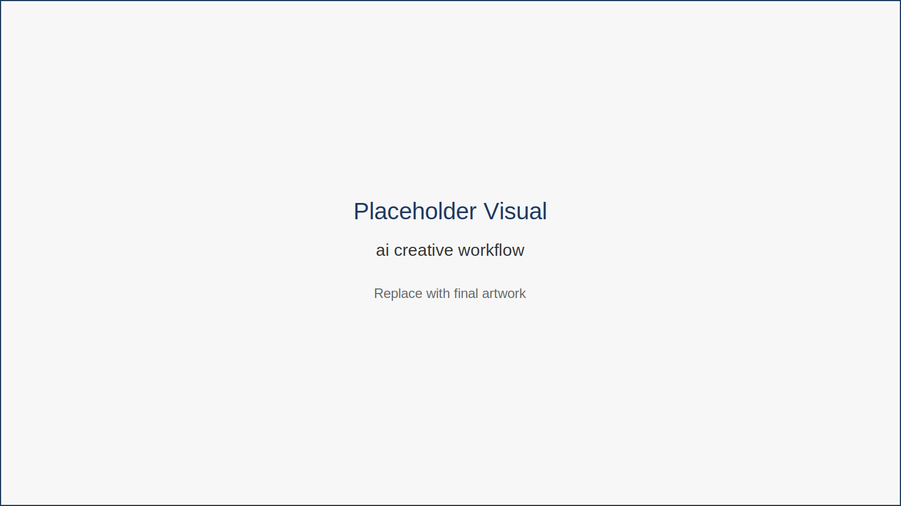
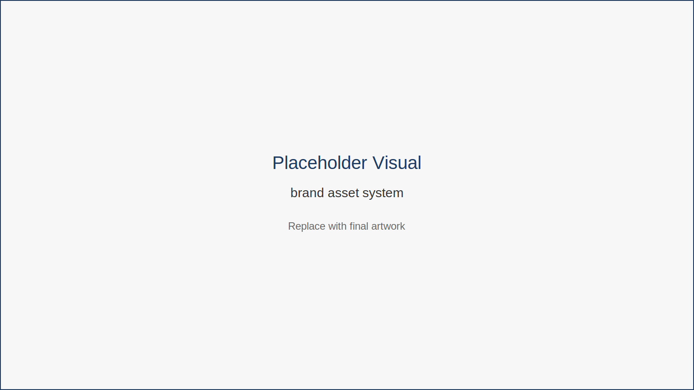

# Creative Work: Design, Content, and Branding

In digital work environments, creativity often determines visibility.

Presentations, visual reports, marketing materials, and personal branding all shape how work is perceived.

Historically these outputs required specialized design skills.

AI is changing that reality.

---

## AI as a Creative Accelerator

Creative AI tools can assist with:

- generating visual assets  
- drafting marketing content  
- designing presentations  
- producing branding elements  

The purpose of these tools is not to eliminate creative thinking.

Instead, they reduce the time required to produce initial concepts and visual structures.

To understand how AI fits into creative work, consider the typical creative workflow.

*Figure 9.1 — AI Creative Workflow*

This workflow illustrates how AI helps generate multiple creative possibilities quickly. Human professionals then evaluate, refine, and finalize the best option.

---

Another important concept is maintaining consistency across brand assets.

*Figure 9.2 — Brand Asset System*

This diagram shows how visual elements, messaging, and templates form a consistent brand identity. AI tools can help generate and maintain these assets efficiently.

---

## Fictional Example

Nadia is an independent consultant building her professional brand.

Instead of hiring a designer for every marketing asset, she uses AI tools to:

- generate presentation templates  
- produce social graphics  
- draft content ideas  

She still refines the final output herself.

But she now produces polished materials much faster.

---

## Key Insight

AI reduces the technical barrier to creative production, allowing professionals to focus on ideas and storytelling.

---

## Chapter Takeaways

- AI enables faster design and content production.  
- Human creativity remains central to strong messaging.  
- Visual communication is becoming a core skill for remote professionals.

---

## Action Plan

Create one professional asset this week using AI assistance.

Examples:

- presentation slide template  
- social media graphic  
- personal website banner  

Focus on speed and clarity rather than perfection.

---

## Transition

Creative work expands output.

But the greatest efficiency gains often appear when repetitive tasks disappear entirely.

That is where automation becomes powerful.
