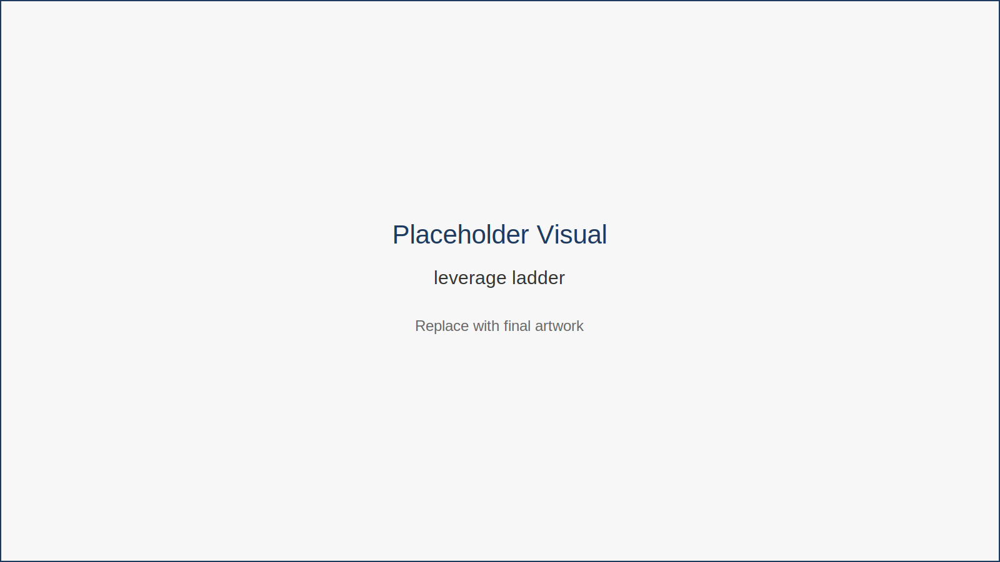
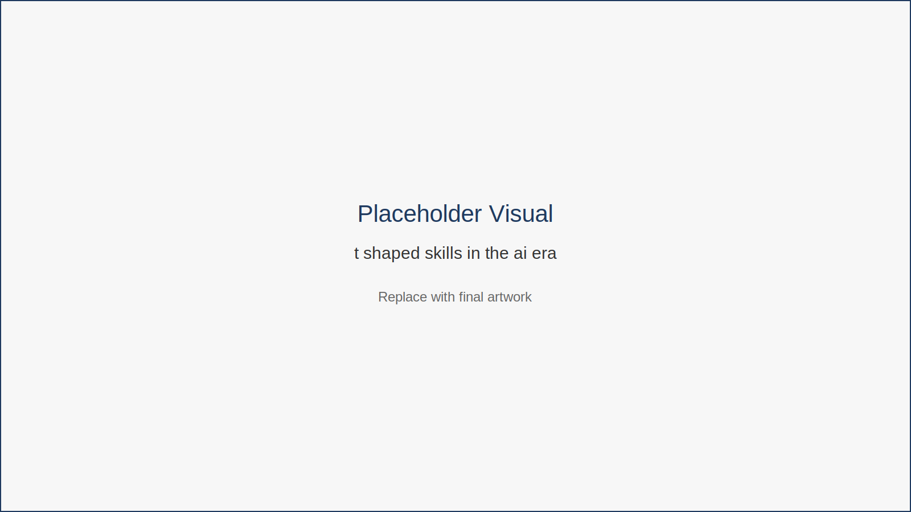

# Future-Proofing Your Career in the AI Era

AI is transforming many professions.

Some tasks are becoming automated.  
Others are expanding.

The professionals who thrive will be those who combine human expertise with AI leverage.

---

## The New Skill Model

The most valuable capabilities combine three layers:

Human skills 
- creativity 
- communication 
- judgment 
- leadership 

AI collaboration skills 
- prompting 
- workflow design 
- automation thinking 

Meta-skills 
- adaptability 
- curiosity 
- continuous learning 

One way to visualize career growth in the AI era is through a leverage ladder.

This ladder illustrates how professionals increase their impact over time—from manual work to AI-assisted workflows and eventually scalable systems.

---

## The Expanding Productivity Economy

Economist Paul Zane Pilzer has argued that wealth in modern economies is not fixed.

Technological innovation expands productivity, allowing individuals and organizations to create far more value than before. Throughout history, breakthroughs such as electricity, industrial machinery, and computers dramatically increased the productive capacity of individuals.

Artificial intelligence may represent a similar shift.

Instead of replacing professionals entirely, AI allows individuals to amplify their capabilities. A single consultant can analyze large datasets. A designer can produce more creative variations in less time. A writer can draft and refine ideas faster than traditional workflows allowed.

This reflects Pilzer’s concept of a dynamic economy — one in which productivity expands through innovation rather than simply redistributing opportunity.

For remote professionals, this means the future of work is not just about protecting existing roles.

It is about learning how to use new tools to increase leverage.

---

Another important framework is the development of broad capability combined with specialized expertise.

This model shows how professionals combine deep expertise in one domain with broad understanding across multiple disciplines.

---

Professionals can also use AI to analyze their own skill gaps.

This diagram demonstrates how AI tools can help identify areas for professional development by comparing current capabilities with emerging industry demands.

---

## Key Insight

Careers evolve when professionals learn to direct technology rather than compete with it.

---

## Chapter Takeaways

- AI will reshape many job roles. 
- Human judgment and creativity remain valuable differentiators. 
- Continuous learning is the best strategy for long-term relevance.

---

## Action Plan

Conduct a simple career audit.

Ask yourself:

- Which parts of my work could be automated? 
- Which parts require human judgment or creativity? 
- What AI skill could amplify my work this year?

Choose one skill to begin developing this month.

---

## Transition to Part III

Throughout this book you have seen how artificial intelligence is reshaping knowledge work.

You have explored how AI can support writing, research, creative work, automation, collaboration, and long-term career development.

But ideas alone are not enough.

Real productivity improvements come from turning ideas into repeatable systems.

The final section of this book focuses on exactly that.

Part III introduces a practical toolkit you can begin using immediately — including a daily workflow playbook, a reusable prompt library, and a curated directory of AI tools.

Together, these resources transform the concepts in this book into a simple operating system for remote work in the AI era.
