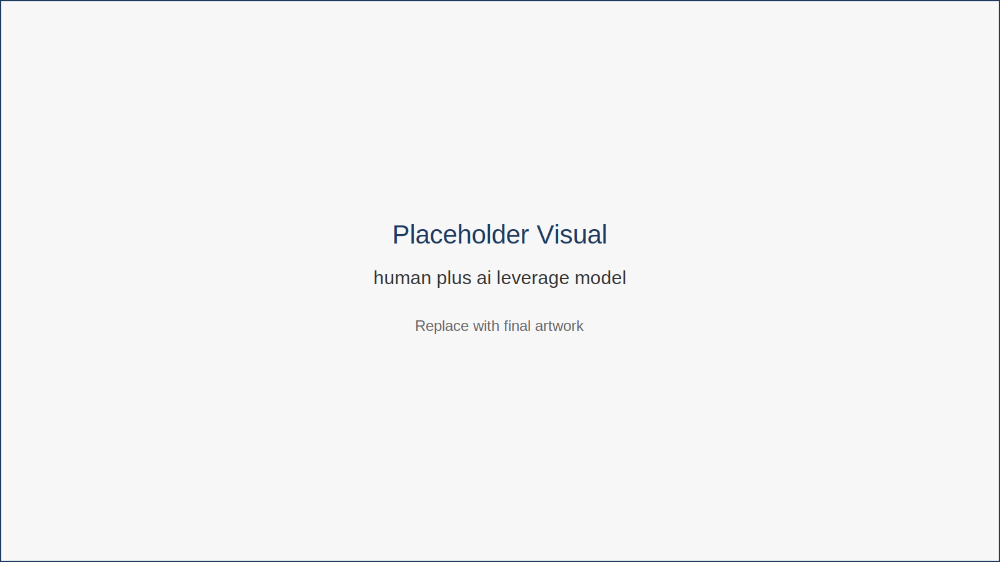
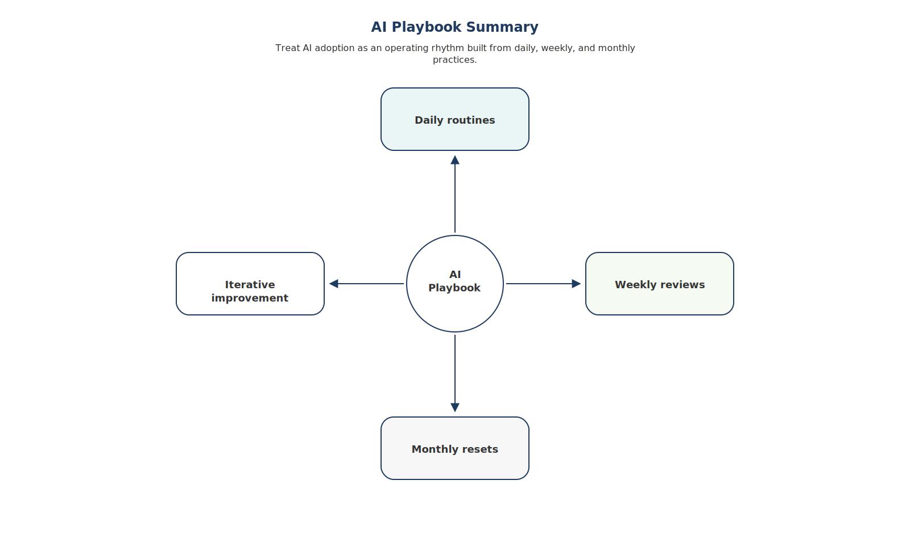
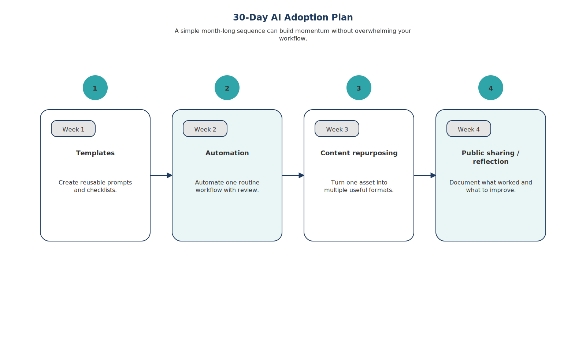

# The Remote Worker’s Playbook

Reading about productivity is useful.

But real improvement happens when ideas turn into repeatable habits.

This chapter distills the entire book into a practical operating system for remote professionals. Think of it as a field guide you can return to whenever your workflow becomes messy or overwhelming.

---

## The AI-Assisted Operating Model

The playbook is built around a simple equation that has appeared throughout this book:

Human judgment  
+  
AI assistance  
+  
Smart workflows  

= **Leverage**

Your role is not to compete with machines.

Your role is to direct them effectively.

The relationship between humans and AI becomes clearer when visualized as a leverage model.

This model illustrates how human judgment, AI assistance, and structured workflows combine to increase professional leverage. AI handles repetitive or computational tasks while humans provide strategy, interpretation, and direction.

---

## The Daily AI Workflow

A practical AI-assisted routine usually follows three stages.

Morning: **AI Triage**

Start the day with a simple question:

*What can AI help with today?*

Typical tasks to accelerate include:

- summarizing emails or meeting notes 
- drafting communications 
- organizing task lists 
- outlining documents 

AI handles preparation so you can focus on decision-making and creative thinking.

Midday: **Deep Work + AI Sprints**

Alternate between two modes:

Deep Work  
Focused work requiring judgment or creativity.

AI Sprints  
Short bursts where AI accelerates drafting, research, or formatting tasks.

End of Day: **Quick Reflection**

Before finishing work, spend two minutes reviewing your day.

Ask:

- What did AI help me accomplish? 
- What tasks still feel repetitive? 
- Could any step be automated?

---

The complete system behind these routines can be summarized in a simple playbook.

This diagram summarizes the core operating rhythm of AI-assisted work: triage, focused execution, reflection, and continuous improvement. Over time these cycles help professionals refine workflows and increase efficiency.

---

## Weekly Review Routine

Once per week, conduct a short workflow review.

Questions to ask:

- Did AI actually save time this week? 
- Did the quality of work improve? 
- Which tasks still feel inefficient?

During this review you can:

- refine prompts 
- adjust automations 
- update templates 

Small improvements accumulate quickly.

---

## Monthly System Reset

Once per month, review your broader system.

Focus on three areas:

**Skills**

Which parts of your work benefit most from AI assistance?

**Visibility**

Update your portfolio or personal brand with examples of AI-assisted work.

**Tools**

Experiment with one new tool that supports your workflow.

---

## Fictional Example

Alex is a freelance marketer managing several clients.

Before adopting a structured workflow, he constantly reacted to messages and deadlines.

After implementing the playbook:

- mornings begin with AI task prioritization 
- meetings automatically generate summaries 
- weekly reviews refine automations 

Within a few months his administrative workload dropped significantly.

More importantly, he regained time for strategy and client relationships.

---

## Key Insight

The goal is not to use AI everywhere.

The goal is to build a workflow where AI removes friction and humans provide direction.

---

## Action Plan — 30 Day AI Adoption

A structured adoption cycle helps turn experimentation into habit.

This plan introduces AI capabilities gradually over four weeks. Each step focuses on a small improvement—templates, automation, content reuse, and knowledge sharing—so that professionals build momentum without overwhelming their workflows.

Week 1 — Create reusable templates  
Week 2 — Automate one repetitive task  
Week 3 — Repurpose existing content using AI  
Week 4 — Share one insight about your workflow

---

## Transition

Workflows improve how you structure your day.

But even the best workflow depends on how effectively you communicate with the tools you use.

When working with AI systems, that communication happens through prompts.

Clear prompts allow you to direct AI assistance, refine outputs, and turn rough ideas into useful results. Poor prompts, on the other hand, often produce vague or unhelpful responses.

The next chapter introduces a practical **prompt toolkit** designed for common remote work tasks — including writing, research, automation, collaboration, and productivity.

Once you understand how to structure prompts effectively, AI becomes far more than a novelty. It becomes a reliable partner in your daily work.
