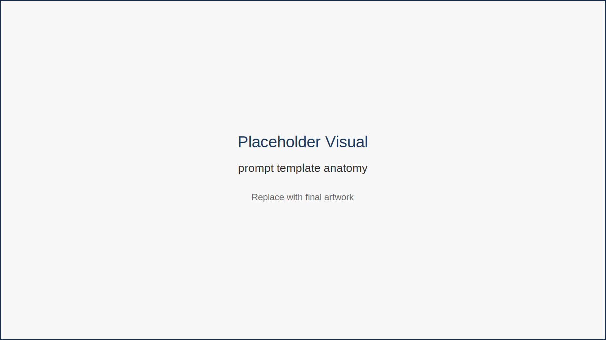
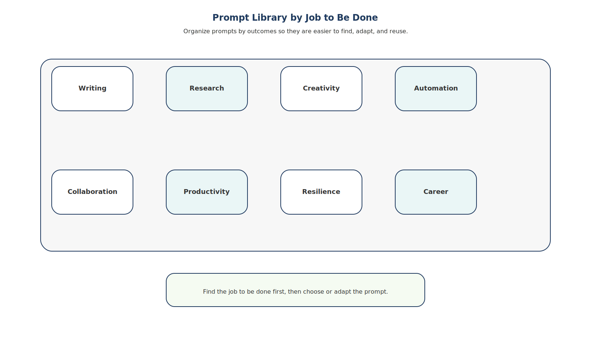

# Prompt Toolkit

AI tools become dramatically more useful when you treat them as thinking partners rather than simple question-answer machines.

The prompts in this chapter provide practical starting points you can adapt to your own work.

They are organized by **job to be done**, not by specific software tools. Each prompt can be used with most modern AI assistants.

The key to reliable results is using a consistent prompt structure.

---

## Understanding Effective Prompt Structure

Effective prompts usually include five elements:

1. **Role** — the perspective the AI should adopt  
2. **Task** — the specific job to perform  
3. **Context** — background information or inputs  
4. **Constraints** — tone, limitations, or rules  
5. **Output Format** — how the response should be structured  

When these elements are included, AI systems are far more likely to produce useful and consistent results.

*Figure 15.1 — Prompt Template Anatomy*

This framework breaks prompts into reusable components that make results more predictable and easier to refine.

---

## Prompt Library by Job to Be Done

Prompts become easier to reuse when organized around professional tasks.

*Figure 15.2 — Prompt Library by Job to Be Done*

These prompts are grouped into categories such as writing, research, creativity, automation, collaboration, and personal productivity.

---

## Writing and Communication

### Email Draft

**Role:** Professional communications assistant  
**Task:** Draft a polite but firm payment reminder email.

**Context**

A client payment is overdue by **[number] days** for **[project or invoice name]**.

**Constraints**

- Maintain a professional tone 
- Avoid sounding aggressive 
- Clearly explain next steps

**Output Format**

Write a concise email including:

1. acknowledgement of previous work 
2. reminder of the outstanding payment 
3. next steps or deadline

---

### Proposal Improvement

**Role:** Business proposal editor  
**Task:** Improve the persuasiveness of the following proposal.

**Context**

Paste proposal text:

[proposal text]

**Constraints**

- Emphasize outcomes 
- Highlight measurable value 
- Maintain professional tone

**Output Format**

Provide:

- revised proposal
- short list of improvements made

---

### Rewrite for Clarity

**Role:** Professional editor  
**Task:** Rewrite the following message for clarity.

**Context**

[text]

**Constraints**

- preserve original meaning
- simplify sentences
- remove unnecessary wording

**Output Format**

Provide:

- rewritten message
- short explanation of improvements

---

### Meeting Summary

**Role:** Meeting analyst  
**Task:** Summarize a meeting transcript.

**Context**

[transcript]

**Constraints**

Focus on decisions and actions.

**Output Format**

Provide:

- key decisions 
- action items 
- open questions

---

### Executive Summary

**Role:** Business analyst  
**Task:** Create an executive summary.

**Context**

[text]

**Constraints**

Focus on major insights only.

**Output Format**

Provide **5–7 bullet points** covering:

- key findings
- implications
- recommended actions

---

## Research and Learning

### Quick Trend Overview

**Role:** Industry research analyst  
**Task:** Identify key trends.

**Context**

Industry: **[industry]**

**Constraints**

Focus on the past 12 months.

**Output Format**

Provide:

1. five major trends
2. explanation of each
3. why it matters

---

### Tool Comparison

**Role:** Technology advisor  
**Task:** Compare two tools.

**Context**

- Tool A: [name] 
- Tool B: [name]

Use case: remote collaboration

**Output Format**

Return a comparison table covering:

- strengths
- weaknesses
- ideal use cases
- typical user

---

### Learning Plan

**Role:** Professional development coach  
**Task:** Create a learning plan.

**Context**

Skill: **[skill]**  
Time available: **30 days**

**Constraints**

Assume beginner level.

**Output Format**

Provide a **4-week learning plan** including:

- weekly focus
- daily activities
- recommended resources

---

### Concept Simplification

**Role:** Technical educator  
**Task:** Explain a complex concept simply.

**Context**

Concept: **[topic]**  
Audience: non-technical professional

**Constraints**

Avoid jargon.

**Output Format**

Provide:

- simple explanation
- one analogy
- one practical example

---

## Creativity and Branding

### Social Media Ideas

**Role:** Content strategist  
**Task:** Generate LinkedIn post ideas.

**Context**

Audience: **[profession or industry]**

**Constraints**

Ideas should be educational and practical.

**Output Format**

Provide five ideas including:

- headline
- topic description
- suggested call-to-action

---

### Blog Outline

**Role:** Content editor  
**Task:** Create a blog outline.

**Context**

Topic: **[topic]**

**Output Format**

Provide:

- title
- section headings
- bullet points under each section

---

### Brand Voice Guide

**Role:** Brand strategist  
**Task:** Define a brand voice.

**Context**

Business: freelance consultant  
Audience: remote professionals

**Output Format**

Provide:

- brand voice description
- tone guidelines
- example phrases

---

### Visual Concept Prompt

**Role:** Creative director  
**Task:** Generate a logo concept.

**Context**

Brand: remote productivity consulting

**Constraints**

Minimalist design.

**Output Format**

Provide:

- logo concept
- color palette
- typography suggestion
- symbolic elements

---

## Automation and Workflows

### Workflow Design

**Role:** Workflow consultant  
**Task:** Design a workflow.

**Context**

Tools:

- Gmail
- Google Drive
- Trello

Goal: manage client projects.

**Output Format**

Provide step-by-step workflow including:

- triggers
- actions
- tools used

---

### Automation Ideas

**Role:** Productivity automation specialist  
**Task:** Suggest useful automations.

**Context**

User: remote freelancer  
Tools used: [list]

**Output Format**

Provide three automation ideas including:

- workflow
- tools required
- time savings

---

### Process Optimization

**Role:** Process improvement advisor  
**Task:** Improve a workflow.

**Context**

[workflow description]

**Output Format**

Provide:

- problems identified
- suggested improvements
- revised workflow

---

## Personal Productivity

### Task Prioritization

**Role:** Productivity coach  
**Task:** Prioritize tasks.

**Context**

[paste tasks]

**Constraint**

Use the Eisenhower Matrix.

**Output Format**

Organize tasks into:

- urgent and important
- important but not urgent
- urgent but not important
- neither

---

### Daily Planning

**Role:** Time-management assistant  
**Task:** Convert tasks into a daily schedule.

**Context**

Work hours: **[hours]**

Task list: [tasks]

**Output Format**

Provide a structured daily schedule.

---

### Weekly Review

**Role:** Productivity analyst  
**Task:** Conduct a weekly review.

**Context**

Completed tasks: [list]

Upcoming commitments: [list]

**Output Format**

Provide:

- summary of accomplishments
- lessons learned
- priorities for next week

---

## Prompt Debugging Guide

Even a strong prompt will not always produce the exact result you want on the first try.

That does not mean AI is useless.

It usually means the prompt needs adjustment.

Prompting works best as an iterative process. You give instructions, review the output, identify what is missing, and refine the request.

The good news is that most weak outputs can be improved quickly once you know what to look for.

---

### Common Prompt Problems

#### 1. The response is too vague

This usually means the task is too broad or the output format is unclear.

**Weak prompt:**

> Help me with my proposal.

**Better follow-up:**

> Act as a business proposal editor. Rewrite the proposal to sound more persuasive for a small business client. Focus on outcomes, cost savings, and clear next steps. Return the result as a revised proposal followed by three suggested improvements.

**Fix:**  
Add a clearer task, more context, and a defined output format.

---

#### 2. The tone is wrong

AI often defaults to a generic style unless you specify tone.

**Weak prompt:**

> Write an email to a client.

**Better follow-up:**

> Act as a professional communications assistant. Draft a short email to a client requesting overdue payment. Keep the tone polite, firm, and professional. Avoid sounding aggressive or emotional.

**Fix:**  
Add tone constraints such as professional, concise, warm, direct, persuasive, or calm.

---

#### 3. The answer is too long or too short

Length problems are often caused by missing constraints.

**Weak prompt:**

> Summarize this report.

**Better follow-up:**

> Summarize this report for a busy executive. Use five bullet points and keep each bullet to one sentence.

**Fix:**  
Specify the desired length and structure.

---

#### 4. The output is generic

Generic output often means the prompt lacks context.

**Weak prompt:**

> Give me ideas for LinkedIn posts.

**Better follow-up:**

> Act as a content strategist. Generate five LinkedIn post ideas for a freelance designer who helps remote teams improve brand consistency. The audience is startup founders and marketing leads. Keep the ideas practical and professional.

**Fix:**  
Add audience, purpose, use case, and background.

---

#### 5. The result ignores important details

This usually means critical constraints were not stated clearly enough.

**Weak prompt:**

> Rewrite this message.

**Better follow-up:**

> Rewrite this message for clarity while preserving the original meaning, deadline, and next steps. Do not remove any factual details.

**Fix:**  
Explicitly state what must be preserved.

---

#### 6. The answer sounds confident but may be wrong

AI can produce plausible language even when accuracy is uncertain.

**Better follow-up:**

> Summarize the main points, but clearly label anything uncertain. Do not invent facts. If information is missing, say so.

For research tasks, you can also ask:

> Separate confirmed information from assumptions and open questions.

**Fix:**  
Ask the AI to identify uncertainty, avoid guessing, and distinguish facts from interpretation.

---

#### 7. The structure is hard to use

Sometimes the information is good, but the format is messy.

**Weak prompt:**

> Review these meeting notes.

**Better follow-up:**

> Review these meeting notes and return the result in three sections: key decisions, action items, and open questions. Use bullet points.

**Fix:**  
Specify headings, bullets, tables, or numbered steps.

---

### A Simple Prompt Debugging Checklist

When a response is weak, ask:

- Did I define the **role** clearly?
- Did I describe the **task** specifically?
- Did I provide enough **context**?
- Did I include useful **constraints**?
- Did I request the right **output format**?

If one of these is missing, that is usually the problem.

---

### A Fast Repair Pattern

When a result is weak, revise the prompt using this pattern:

**Act as** [role].  
**Help me** [task].  
**Here is the context:** [background or source material].  
**Keep these constraints in mind:** [tone, length, must-keep details, limitations].  
**Return the result as:** [format].

Example:

> Act as a professional editor. Rewrite the following client update so it sounds clear, confident, and concise. Preserve the original meaning and next steps. Return the result as a polished email followed by two brief notes explaining what you improved.

---

### Use Follow-Up Prompts Instead of Starting Over

You do not always need to rewrite the entire prompt.

Often, a short follow-up works:

- Make this shorter and more direct.
- Rewrite this for a non-technical audience.
- Turn this into bullet points.
- Keep the tone warm but more professional.
- Preserve the meaning, but simplify the wording.
- Add a clearer call to action.
- Separate facts from assumptions.
- Give me three stronger alternatives.

This is one of the most practical ways to work with AI effectively.

---

## The Prompt Improvement Loop

Effective prompting rarely happens in a single attempt.

Instead, it works best as a short iterative cycle where you refine instructions based on the response you receive.

Think of prompting as a collaboration process rather than a one-time command.

A simple improvement loop looks like this:

1. **Start with a clear prompt**  
   Define the role, task, context, constraints, and desired output format.

2. **Review the AI response critically**  
   Ask yourself:
   - Is the answer accurate?
   - Is the tone appropriate?
   - Is the structure useful?
   - Is anything missing?

3. **Identify the specific problem**  
   Common issues include:
   - vague results
   - missing details
   - incorrect tone
   - too much or too little information

4. **Refine the prompt with clearer instructions**  
   Adjust the prompt by adding:
   - more context
   - stronger constraints
   - clearer formatting requirements

5. **Repeat until the result is useful**  
   Most improvements happen within one or two follow-up prompts.

---

### Example: Improving a Prompt

**Initial Prompt**

> Summarize this report.

Result: vague summary with missing insights.

---

**Improved Prompt**

> Act as a business analyst.  
> Summarize the following report for a senior executive.  
> Focus on key findings, risks, and recommended actions.  
> Return the result as five concise bullet points.

Result: clearer, structured summary.

---

### Practical Tip

You do not always need to rewrite the entire prompt.

Often a short follow-up works:

- “Make this more concise.”
- “Rewrite this for a non-technical audience.”
- “Turn this into bullet points.”
- “Highlight the three most important insights.”
- “Keep the meaning but simplify the language.”

Small adjustments often produce dramatically better results.

---

## Key Insight

Prompting is not about finding perfect words.

It is about giving clear instructions, evaluating the response, and refining the collaboration between human judgment and AI assistance.

---

## Chapter Takeaways

- Prompt design is a professional skill.
- Clear structure produces better results.
- Context and constraints improve reliability.
- Iteration improves outputs.
- Building a prompt library saves time.

---

## Transition

Prompts determine how effectively you communicate with AI.

But prompts are only part of the system.

The tools you choose also shape how smoothly your workflows operate.

The final chapter provides a curated directory of AI tools organized by common workflow categories, helping you select practical tools that support the systems you have built throughout this book.
