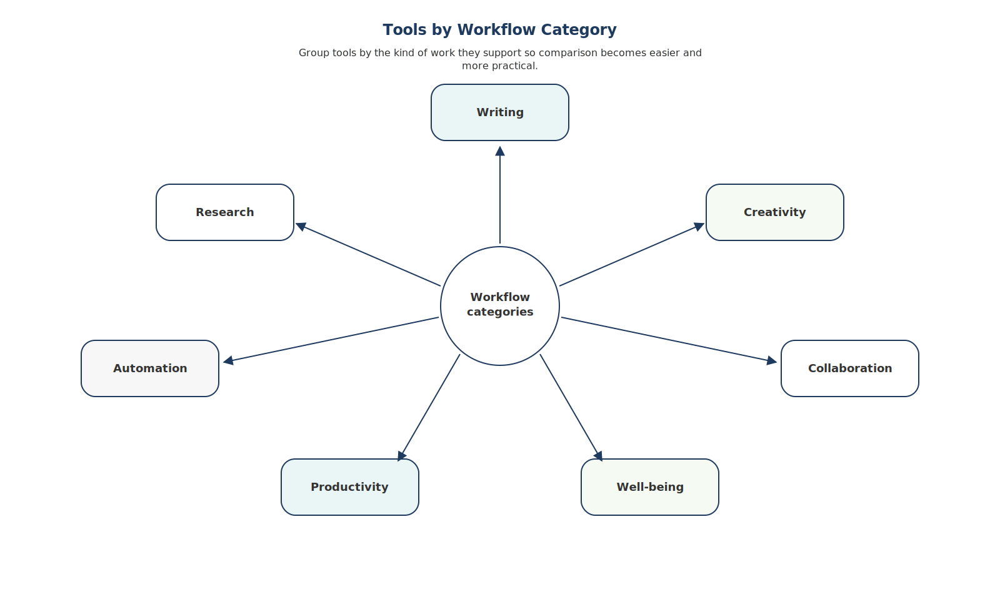
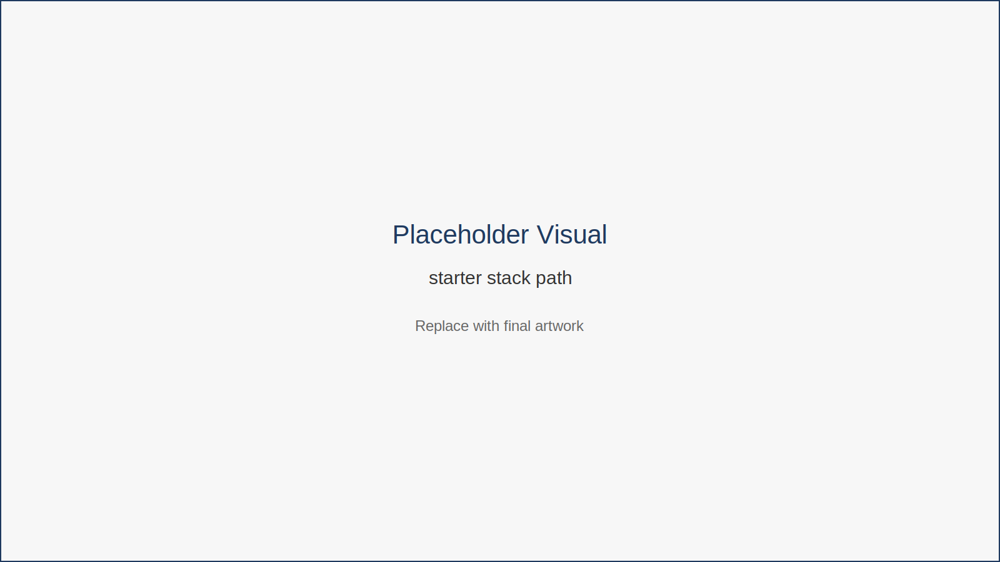

# AI Tools Directory

## Purpose of This Directory

This directory is not meant to overwhelm you with options.

Instead, it provides a structured overview of useful AI tools organized by **job to be done**.

Remember:

Tools support workflows.  
Workflows support human judgment.

Choose tools that match your real needs.

---

## Understanding the Tool Landscape

AI tools can be grouped according to the type of workflow they support.

*Figure 16.1 — Tools by Workflow Category*

This diagram groups tools by the type of work they support—writing, research, creativity, automation, collaboration, and productivity. Organizing tools this way helps professionals select tools based on workflow needs rather than popularity.

---

## Writing and Communication Tools

### Writing Tools  

AI Assistants  
ChatGPT  
Claude  

Uses:

- drafting emails  
- brainstorming ideas  
- summarizing documents  

### Editing Tools  

GrammarlyGO  
Jasper  

Uses:

- tone adjustments  
- clarity improvements  
- marketing copy refinement

---

## Research and Learning Tools

### Research Assistants  

Perplexity AI  
Elicit  

Uses:

- research synthesis  
- literature summaries  
- quick fact discovery  

### Learning Platforms  

Khanmigo  
Duolingo Max  

Uses:

- tutoring  
- language learning  
- structured skill development

---

## Creativity and Branding Tools

### Design Platforms  

Canva AI  
Adobe Firefly  

### Image Generation  

Midjourney  
DALL-E

Uses:

- concept art  
- marketing visuals  
- creative exploration

---

## Automation Tools

Zapier  
Make  

Uses:

- connecting apps  
- automating workflows  
- transferring data between systems

---

## Collaboration Tools

Otter.ai  
Fireflies  
Fathom  

Uses:

- meeting transcription  
- automated summaries  
- searchable conversation records

---

## Productivity and Organization

Notion AI  
Motion  
Sunsama  

Uses:

- task prioritization  
- knowledge management  
- calendar automation

---

## Building Your Starter Stack

For most professionals, the goal is not dozens of tools but a **simple integrated system**.

*Figure 16.2 — Starter Stack Path*

This diagram illustrates a gradual path for building a tool stack. Professionals typically begin with an AI assistant and a task manager, then gradually add automation, creative tools, and integrations as workflows mature.

---

## Key Insight

A powerful tool stack is **small, intentional, and integrated**.

Most remote professionals only need a few tools in each category.

---

## Chapter Takeaways

- Tools should support workflows, not dominate them.  
- Start with a small set of reliable tools.  
- Expand gradually as your workflows evolve.

---

## Closing Reflection

Remote work and AI are not temporary trends.

They are reshaping how knowledge work happens.

The professionals who thrive in this environment will combine:

human judgment  
AI assistance  
and smart workflows.

This toolkit is not the end of the journey.

It is the beginning of a new way of working.
